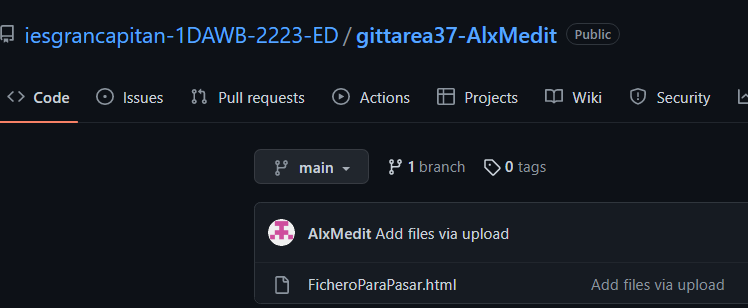
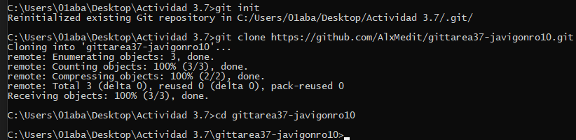
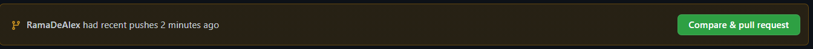
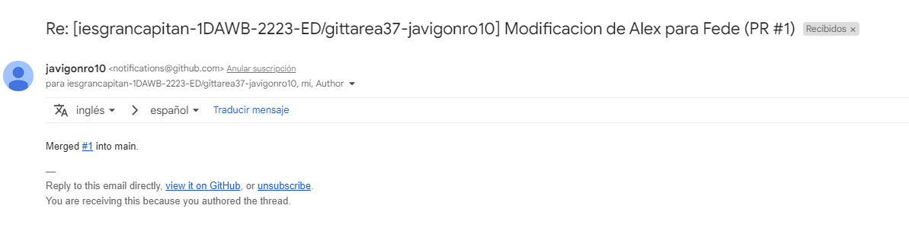

# Tarea Git 3.7: Pull Request y Tags de git
Primero generamos el fichero el cual hará pull request el compañero

Lo subimos para que el pueda cogerlo y hacer su práctica

Primero generamos un fork para tener el respositorio del compañero dentro de nuestro git para poder modificarlo

Como podemos ver tenemos el repo del compañero clonado en nuestro perfil, por lo cual este lo cogemos, y lo clonamos dentro de un directorio local

Para trabajar en el repo y posteriormente poder devolverselo a nuestro compañero, hacemos una rama y trabajaremos en ella, modificaremos el archivo y posteriormente y le haremos un push al repo en línea

Ahora como vemos haremos el pull request de la modificación especificando los detalles de lo que hemos hecho

Luego el compañero aceptará esa request desde su propio repositorio como podemos ver se hace un merge del que yo le mandé con el que él recibió mediante el pull

Para hacer un tag copiaremos nuestro repo dentro de un directorio en nuestro equipo local, le haremos una modificación al archivo y posteriormente usaremos el comando git tag "id" para poder identificar al mismo y posteriormente mediante git push --tag enviaremos un push de ese tag para que se le aplique al repo bajo el que estemos trabajando

Como podemos apreciar ahora nuestro repo contiene 1 Tag que es el v1.0 que le hemos puesto

